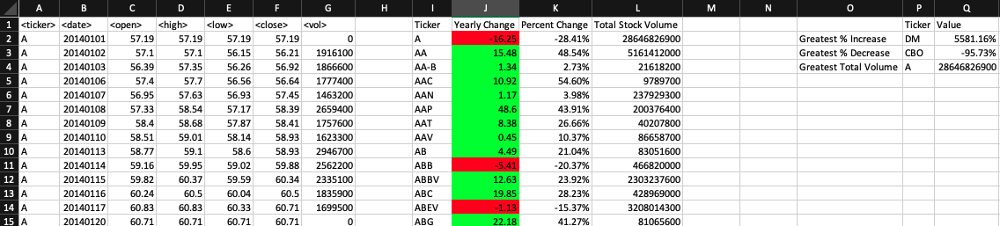
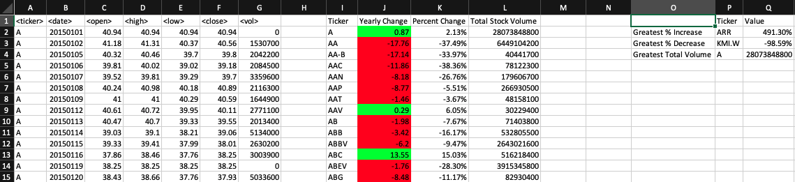
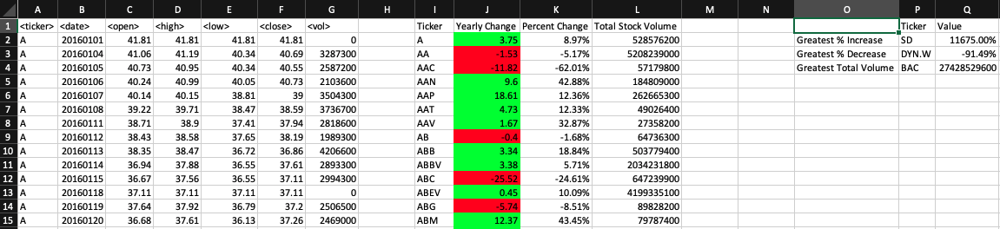

# VBA Challenge - The VBA of Wall Street

### Files

* [Stock Data](Resources/Multiple_year_stock_data.xlsm) 

* [VBS](Resources/Multiple_year_stock_data.vbs) 

### Stock market analysis
* 2014 - 2016 Stock Market

* 2014

* 2015

* 2016

## Instructions

* Create a script that will loop through all the stocks for one year and output the following information.

  - [x] The ticker symbol.

  - [x] Yearly change from opening price at the beginning of a given year to the closing price at the end of that year.

  - [x] The percent change from opening price at the beginning of a given year to the closing price at the end of that year.

  - [x] The total stock volume of the stock.

* You should also have conditional formatting that will highlight positive change in green and negative change in red.

* The result should look as follows.

### CHALLENGES

- [x]1. Your solution will also be able to return the stock with the "Greatest % increase", "Greatest % decrease" and "Greatest total volume". The solution will look as follows:

- [x]2. Make the appropriate adjustments to your VBA script that will allow it to run on every worksheet, i.e., every year, just by running the VBA script once.

